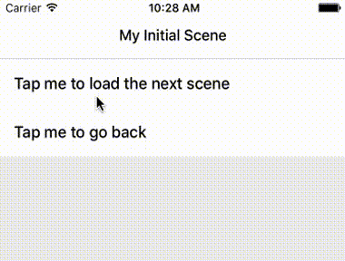

# NavigatorApp

关于Navigator的例子，整理于官网例子－**Using Navigators**，[**点击查看**](http://facebook.github.io/react-native/docs/using-navigators.html)。

### React Native版本
0.30

### 实现功能
- 点击“Tap me to load the next scene”跳转到下一页
- 点击“Tap me to go back”返回
### 效果如下[没有写Style]

